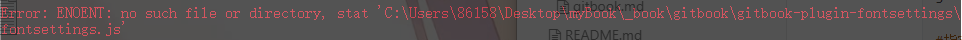

###  gitBook入门

> 配置和目录简洁，但不易私人定制化

-  ####  gitbook安装

  ``` shell
  npm install -g gitbook-cli
  ```

  

- #### gitbook初始化项目

  ``` shell
  gitbook init
  ```

  > 生成README.md为样本文件
  >
  > 生成SUMMARY.md为目录文件
  >
  > 可以手动创建**book.json**配置文件

  

- #### gitbook运行

  ```shell
  #默认4000端口
  gitbook serve
  
  #指定端口
  gitbook serve --port 2333
  ```

  

- #### gitbook编译

  ```shell
  gitbook build
  ```

-  ### book.json配置文件

   ```js
   {
       "title": "myBook",
       "author": "wuwei",
       "description": "some note",
       "language": "zh-hans",
       "gitbook": "3.2.3",
       "styles": { // 自定义页面样式
           "website": "./styles/website.css"
       },
       "structure": { // 指定 Readme、Summary、Glossary 和 Languages 对应的文件名
           "readme": "README.md"
       },
       "links": { // 在左侧导航栏添加链接信息
           "sidebar": {
               "百度": "http://www.baidu.com"
           }
       },
       "plugins": [ // 配置使用的插件
           "-sharing",
           "splitter",
           "expandable-chapters-small",
           "anchors",
           "github",
           "github-buttons",
           "donate",
           "sharing-plus",
           "anchor-navigation-ex",
           "favicon"
       ],
       "pluginsConfig": { // 配置插件的属性
           "github": {
               "url": "https://github.com"
           },
           "github-buttons": {
               "buttons": [{
                   "user": "Blankj",
                   "repo": "glory",
                   "type": "star",
                   "size": "small",
                   "count": true
                   }
               ]
           },
           "donate": {
               "alipay": "./source/images/donate.png",
               "title": "",
               "button": "赞赏",
               "alipayText": " "
           },
           "sharing": {
               "douban": false,
               "facebook": false,
               "google": false,
               "hatenaBookmark": false,
               "instapaper": false,
               "line": false,
               "linkedin": false,
               "messenger": false,
               "pocket": false,
               "qq": false,
               "qzone": false,
               "stumbleupon": false,
               "twitter": false,
               "viber": false,
               "vk": false,
               "weibo": false,
               "whatsapp": false,
               "all": [
                   "google", "facebook", "weibo", "twitter",
                   "qq", "qzone", "linkedin", "pocket"
               ]
           },
           "anchor-navigation-ex": {
               "showLevel": false
           },
           "favicon":{
               "shortcut": "./source/images/favicon.jpg",
               "bookmark": "./source/images/favicon.jpg",
               "appleTouch": "./source/images/apple-touch-icon.jpg",
               "appleTouchMore": {
                   "120x120": "./source/images/apple-touch-icon.jpg",
                   "180x180": "./source/images/apple-touch-icon.jpg"
               }
           }
       }
   }
   ```

   


- ### 坑



> 解决：在C盘用户目录下.gitbook\versions\3.2.3\lib\output\website\copyPluginAssets.js
>
> ``` js
> confirm: true
> 替换成
> confirm: false
> ```